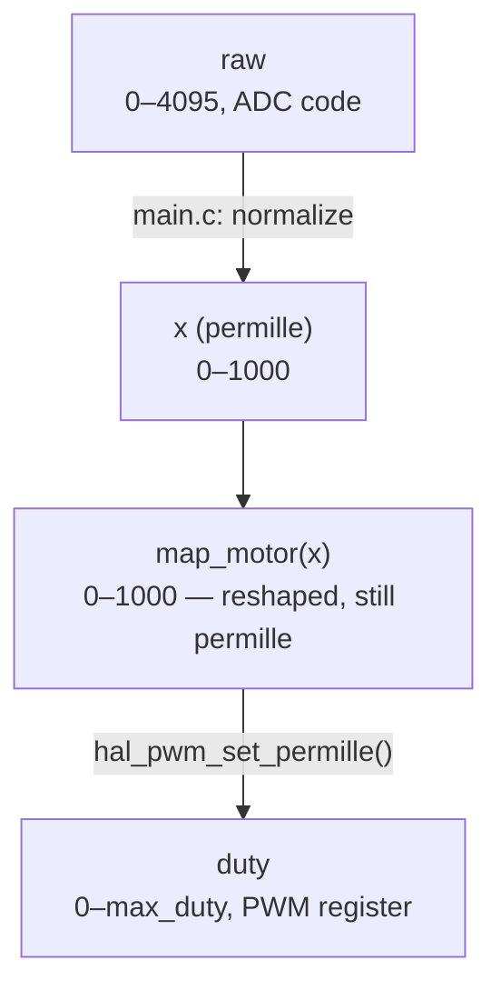

# ESP32-S3 Potentiometer → LED Brightness & Motor Speed

A single potentiometer drives two independent PWM outputs — LED brightness
and DC motor speed — through a small portable HAL, continuing directly from
the ADC voltage-divider project. The LED and the motor never affect each
other's operation: separate LEDC timers, separate output-mapping functions,
separate power stages.

---

## 1. Circuit

### 1.1 Potentiometer (GPIO4)

3-terminal potentiometer wired as a divider, wiper into the ADC — carried
over unchanged from the ADC voltage-divider project:

```
   3V3 ──── Terminal 1
             │
   ADC ──── Terminal 2 (wiper) ──► GPIO4 (ADC1_CH3)
             │
   GND ──── Terminal 3
```

One reading from `hal_adc_read_raw()` drives both output branches below,
independently, through their own mapping functions.

### 1.2 LED branch (GPIO18)

Straightforward current-limited LED:

```
GPIO18 ──[resistor]──► LED ──► GND
```

Duty cycle on this pin comes from `map_led(x)` — currently just the dead
zone cutoff (§4.2); no gamma correction yet (parked as a future idea, §7).

### 1.3 Motor branch — NPN low-side switch

The motor **cannot** be driven directly from a GPIO (a GPIO sources tens of
mA; a small DC motor draws hundreds of mA, and its winding produces a
voltage spike when switched off). A BJT sits between the motor and ground
instead, switched by the GPIO through a base resistor:

```
 Motor supply V+ ───┬──────────────┐
                    │              │
                 [Diode]        ┌──┴──┐
              (cathode → V+)    │  M  │
                    │           └──┬──┘
                    └──────────────┤
                                   │ Collector
 GPIO ──[Rb]───┬──────────────── Base    NPN (BC547)
               │                   │ Emitter
            [10 kΩ]                │
               │                   │
 ESP32 GND ────┴───────────────────┴──── Motor supply GND (common)
```

| Part | Why |
|---|---|
| NPN transistor (BC547) | Low-side switch — carries motor current, driven by base current from the GPIO |
| Flyback diode across the motor | Gives inductive kickback current a safe path (§1.4) |
| Rb (base resistor) | Limits/sets base current so the transistor saturates (§3) |
| 10 kΩ base pull-down | Keeps the transistor off before firmware configures the pin (§1.5) |
| Common ground | Motor supply GND and ESP32 GND **must** be the same net, or the base signal has no reference |

### 1.4 Why the flyback diode is mandatory

A motor winding is an inductor. Inductors resist sudden changes in current:
when the transistor switches off, the collapsing magnetic field drives the
winding voltage to spike **far above** the supply rail, in the reverse
direction, for a brief moment. Without a path for that current, the spike
lands on the transistor's collector and can exceed its breakdown voltage —
a real way to destroy a switching transistor.

The diode is wired backwards relative to normal current flow (cathode to
V+, anode to the collector), so it's reverse-biased and does nothing during
normal operation. It only conducts during the kickback moment, giving that
current a loop to dissipate in instead of tearing through the transistor.

### 1.5 Why the base pull-down resistor is mandatory

The internal GPIO pull-down (`gpio_set_pull_mode` / `gpio_config`) is only
active **after firmware runs it** — and there's a real gap between power-on
and that line of code executing (ROM bootloader → second-stage bootloader →
ESP-IDF init). During that gap the pin floats, and noise coupling near a
switching motor/diode line can be enough to nudge the base above `Vbe`,
partially turning the transistor on before the firmware has even started.

The external 10 kΩ resistor is active from t=0, independent of firmware
state, and low-impedance enough to hold the base solidly below `Vbe` even
next to motor noise. Internal pull resistors on both ESP32-S3 and STM32 are
weak (tens of kΩ, imprecise) and firmware-gated — fine for a button input,
not for a line that can switch a motor.

---

## 2. Sizing the base resistor (Rb)

Datasheet `hFE` (BC547: 110–800) describes the **linear** region — not
useful for switching. To guarantee the transistor is actually saturated
(low `Vce`, not acting as a lossy amplifier), use a much lower **forced
beta**, taken directly from the datasheet's own `Vce(sat)` test condition:

```
Vce(sat) tested at Ic = 100 mA, Ib = 5 mA  →  forced β = 100/5 = 20
```

```
Ib = Ic / forced_β
Rb = (Vgpio − Vbe) / Ib          (Vbe ≈ 0.7 V)
```

**Worked example** — motor drawing 60 mA (kept under BC547's 100 mA
absolute max, with margin):

```
Ib = 60 mA / 20 = 3 mA
Rb = (3.3 V − 0.7 V) / 3 mA = 867 Ω  →  pick 820 Ω
```

**Verify on the bench**: with the channel at full duty, measure
collector-to-emitter voltage directly.

| Vce measured | Meaning |
|---|---|
| ≲ 0.3 V | Saturated — correct |
| ≳ 1 V | Still in linear region — lower Rb (more base current) |

BC547 absolute limits used in this design: `Ic ≤ 100 mA` continuous,
`Vceo = 45 V`, `Ptot ≈ 500–625 mW`. For a motor drawing more than roughly
60–70 mA continuously, a single BC547 is undersized — use a Darlington
pair or a dedicated power transistor instead.

---

## 3. PWM facts (ESP32-S3 LEDC)

- **Timer vs. channel**: a *timer* sets frequency + resolution for
  everything attached to it; a *channel* binds one timer to one GPIO. LED
  and motor use **separate timers** — changing one channel's frequency
  never touches the other.
- **Frequency ↔ resolution is a single shared budget**:

  ```
  max_bits ≈ log2(timer_clock / freq_hz)        (timer_clock ≈ 80 MHz)
  ```

  | Channel | Frequency | Resolution used | Why |
  |---|---|---|---|
  | LED | 5 kHz | 13-bit (8191 steps) | No physical threshold — extra resolution only buys smoothness |
  | Motor | 2 kHz | 8-bit (255 steps) | BJT switches slower than a MOSFET; resolution here is already overkill at 8 bits |

- **Two-phase duty write**: `ledc_set_duty()` stages a new value;
  `ledc_update_duty()` applies it, synchronized to the next PWM period —
  this avoids a torn, mid-period duty change.
- `max_duty = (1 << duty_resolution) - 1` — same "N-bit counter, zero-based"
  logic as `ADC_MAX_CODE` in the original ADC README.

---

## 4. The permille pipeline

Two *separate* conversions happen, at two different layers, and they don't
share a scale by coincidence — they share it because `permille` (0–1000)
is the deliberately hardware-neutral interface between `main.c` and both
HALs.



`map_motor`/`map_led` never touch hardware units — they only reshape a
value that stays in permille on both ends. The actual scale change
(permille → real register duty) happens once, inside the PWM HAL, using
`max_duty` from that channel's own resolution — never `1000`.

### 4.1 Motor dead zone + start stretch

Calibrated experimentally (rising test finds `START`, falling test finds
`DEADZONE` — the gap exists because static friction, which must be
overcome to start a stopped shaft, is higher than kinetic friction, which
only needs to be overcome to keep it turning):

```
MOTOR_DEADZONE = 250   // below this, force duty = 0
MOTOR_START    = 650   // as soon as active, jump straight to this — no weak/buzzing zone

span_in  = 1000 - DEADZONE
span_out = 1000 - START
scaled   = (x - DEADZONE) * span_out / span_in
duty_out = START + scaled
```

| x (input) | Result |
|---|---|
| 249 | 0 |
| 250 | 650 (instant jump — never lingers in the buzz-without-spin zone) |
| 1000 | 1000 |

### 4.2 LED dead zone

`LED_DEADZONE = 20` permille absorbs ADC noise near zero (raw code stays
in the 0–50 range even with the pot fully at minimum — normal ESP32-S3 ADC
noise floor, not a wiring fault). No stretch/jump needed here like the
motor has — LED has no physical "won't turn on below X" threshold, only a
noise floor to clip. Above the dead zone, `map_led(x)` currently just
returns `x` unchanged (see §7 for the planned gamma curve).

---

## 5. HAL architecture

```
main.c  (app layer — 100% portable)
   │  includes ONLY:
   ├── adc_hal.h        hal_adc_init / read_raw / resolution_bits
   └── pwm_hal.h         hal_pwm_init / set_permille(channel, permille)
        │
        │  implemented by:
   ├── adc_hal_esp32s3.c   wraps esp_adc/adc_oneshot.h
   └── pwm_hal_esp32s3.c   wraps driver/ledc.h — timer/channel/freq/res
                            tables live here, never in main.c
```

**STM32 port — what maps to what**

| Concept | ESP32-S3 | STM32Cube HAL |
|---|---|---|
| PWM timer + channel | LEDC timer/channel | `TIMx` peripheral |
| Frequency/resolution tradeoff | `duty_resolution` vs `freq_hz` | Same tradeoff via `PSC`/`ARR` |
| Two-phase duty write | `ledc_set_duty` + `ledc_update_duty` | `__HAL_TIM_SET_COMPARE` (applies same cycle unless using preload) |
| Base pull-down | External resistor (mandatory either way) | Same — `PUPDR` internal pull is equally firmware-gated |

`main.c`, `pwm_hal.h`, and `adc_hal.h` are expected to need **zero**
changes for this port — only new `_stm32.c` files implementing the same
functions.

---

## 6. Debugging notes from this session

- **ADC never reads exactly 0** at the pot's minimum — chip noise floor +
  wiper resistance, typically single digits to a few dozen raw codes.
  Solved by `LED_DEADZONE`/`MOTOR_DEADZONE`, not by chasing a perfect zero.
- **Check Vce(sat) on the bench**, not just in theory — confirms Rb is
  actually driving the transistor into saturation under real load.
- **Common ground is not optional** — motor noise on a shared, resistive
  ground path can show up as ADC jitter; verify by comparing potentiometer
  readings with the motor stopped vs. running.
- **`ledc_timer_config()`/`ledc_channel_config()` are copy-in** — the local
  config struct can go out of scope right after the call; the driver reads
  it synchronously and writes straight to hardware registers.

---

## 7. Future idea: LED gamma correction (not implemented yet)

Deliberately left out of this pass — `map_led` currently only applies the
dead zone (§4.2) and passes `x` straight through otherwise. Parking the
reasoning and the formula here for whenever it's picked back up.

Human brightness perception is closer to a power law than linear, so a
linear duty cycle makes most of the visible change happen in the first
third of the pot's travel. A `duty = x^γ` curve (γ ≈ 2.2) would compensate
— independent of PWM resolution, which only affects how smoothly that
curve gets represented, not whether it's needed.

| x (permille) | gamma_out (γ=2.2) |
|---|---|
| 0 | 0 |
| 100 | 6 |
| 200 | 29 |
| 300 | 71 |
| 400 | 133 |
| 500 | 218 |
| 600 | 325 |
| 700 | 456 |
| 800 | 612 |
| 900 | 793 |
| 1000 | 1000 |

If/when this gets added: interpolate between table points with the same
formula as the motor stretch (§4.1): `y = y0 + (x - x0) * (y1 - y0) / (x1 - x0)`.

---

*This file extends the original ADC voltage-divider README with the PWM
output stage. The interactive potentiometer → duty demo (live sliders for
`MOTOR_DEADZONE`/`MOTOR_START`/PWM resolution) was built and explored
directly in the chat session — ask if you'd like it published as a
standalone page as well.*
